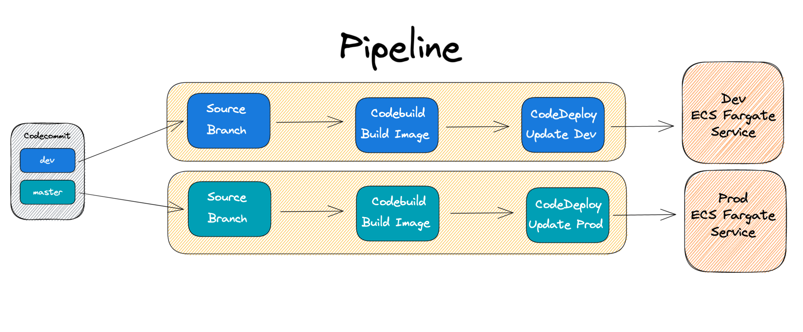

# This Repository is for demo ECS Fargate CICD via CodePipeline and Source CodeCommit to Deploy DEV and PROD environments.



### To Install
```bash
yarn
```

### To Diff
```bash
cdk diff
```

### To Deploy
```bash
cdk deploy
```

### Release Image Tag.
```bash
aws ecr get-login-password --region ap-northeast-1 | docker login --username AWS --password-stdin ${AWS_ACCOUNT_ID}.dkr.ecr.${AWS_REGION}.amazonaws.com
docker pull nginx
docker tag nginx ${AWS_ACCOUNT_ID}.dkr.ecr.${AWS_REGION}.amazonaws.com/nginx:1.0.0
docker push ${AWS_ACCOUNT_ID}.dkr.ecr.${AWS_REGION}.amazonaws.com/nginx:1.0.0
```

### To commit and push to CodeCommit
Step 1: Prerequisites
You must use a Git client that supports Git version 1.7.9 or later to connect to an AWS CodeCommit repository. If you do not have a Git client, you can install one from Git downloads. [View Git downloads page](https://git-scm.com/downloads)

You must have an AWS CodeCommit managed policy attached to your IAM user, belong to a CodeStar project team, or have the equivalent permissions. [Learn how to create and configure an IAM user for accessing AWS CodeCommit.](https://docs.aws.amazon.com/console/codecommit/connect-gc-np) | [Learn how to add team members to an AWS CodeStar Project.](https://docs.aws.amazon.com/console/codecommit/connect-codestar-team-np)

Step 2: Git credentials
Create Git credentials for your IAM user, if you do not already have them. Download the credentials and save them in a secure location. [Generate Git Credentials](https://docs.aws.amazon.com/console/codecommit/connect-gc-np)
Step 3: Clone the repository
Clone your repository to your local computer and start working on code. Run the following command:
```bash
git clone https://git-codecommit.ap-northeast-1.amazonaws.com/v1/repos/ecsCicdDemo

cd ecsCicdDemo

git checkout -b dev

echo "1.0.0" > version.txt

git add version.txt

# push dev branch will start the pipeline.
git push origin dev
```


### To Destroy
```bash
cdk destroy
```