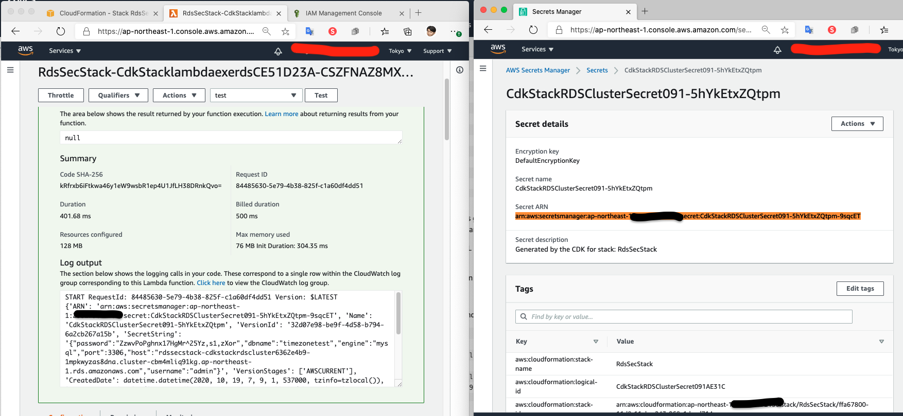
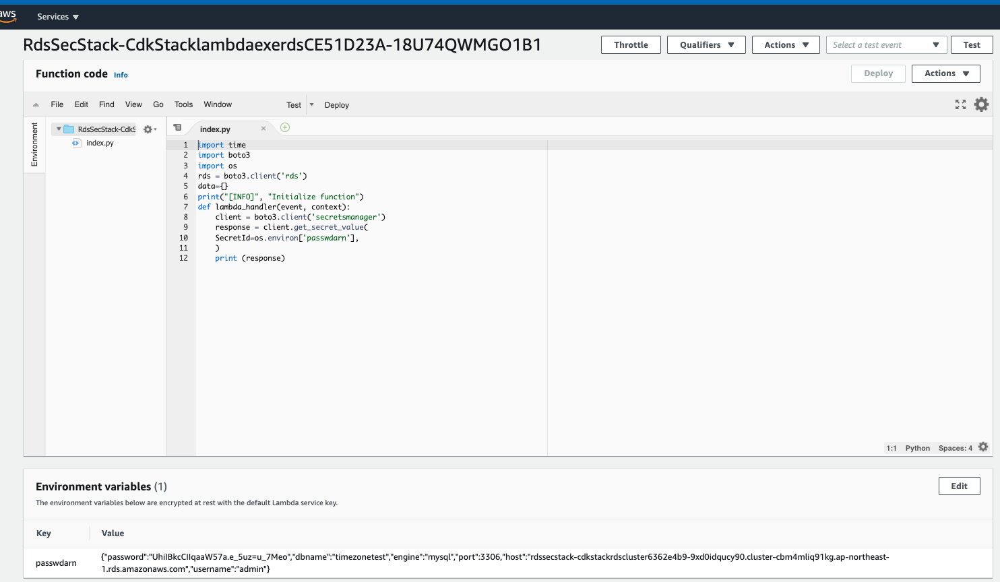

# Welcome to your CDK TypeScript project!

This is a blank project for TypeScript development with CDK.

The `cdk.json` file tells the CDK Toolkit how to execute your app.

## Useful commands

 * `npm run build`   compile typescript to js
 * `npm run watch`   watch for changes and compile
 * `npm run test`    perform the jest unit tests
 * `cdk deploy -c IP='1.2.3.4/32'`      deploy this stack to your default AWS account/region
 * `cdk diff -c IP='1.2.3.4/32'`        compare deployed stack with current state
 * `cdk synth -c IP='1.2.3.4/32'`       emits the synthesized CloudFormation template

## Use dbcluster.secret?.secretArn

## Use dbcluster.secret?.secretValue

### But you can't use it in CfnOutput :) 